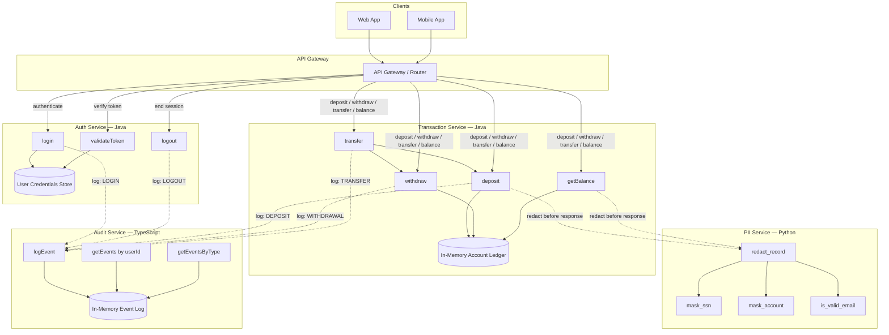
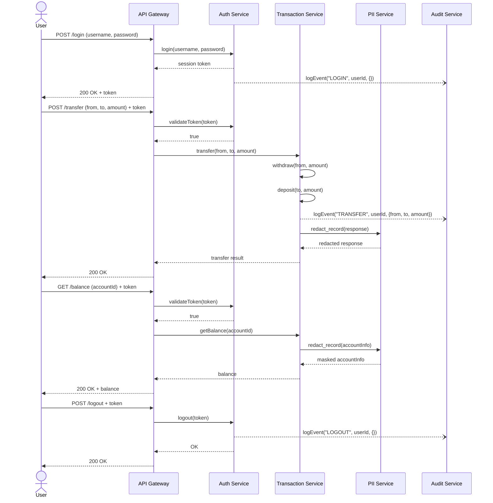

# ClearBank Core — Architecture

## System Overview



## Service Details

### Auth Service (Java)

Manages user identity and session lifecycle.

| Method | Description |
|--------|-------------|
| `login(username, password)` | Validates credentials against the user store and returns a session token (`valid-<user>-<timestamp>`) |
| `validateToken(token)` | Checks that a token has the expected `valid-` prefix |
| `logout(token)` | Terminates the session associated with the given token |

**Data store:** In-memory `HashMap<String, String>` of username → password.

---

### Transaction Service (Java)

Core financial engine handling all money movement and balance operations.

| Method | Description |
|--------|-------------|
| `deposit(accountId, amount)` | Credits the account and returns the new balance |
| `withdraw(accountId, amount)` | Debits the account (fails on insufficient funds) and returns the new balance |
| `transfer(fromId, toId, amount)` | Atomically withdraws from one account and deposits to another |
| `getBalance(accountId)` | Returns the current balance (fails if account does not exist) |

**Data store:** In-memory `HashMap<String, Double>` of accountId → balance.  
**Seeded accounts:** `ACC001` ($1,000), `ACC002` ($500), `ACC003` ($2,500).

---

### PII Service (Python)

Protects sensitive customer data before it leaves the platform.

| Function | Description |
|----------|-------------|
| `mask_ssn(ssn)` | Replaces all but the last 4 digits of a SSN → `XXX-XX-1234` |
| `mask_account(account_number)` | Replaces all but the last 4 characters → `****5678` |
| `is_valid_email(email)` | Basic format check (`@` and `.` in domain) |
| `redact_record(record)` | Applies SSN masking, account masking, and email validation to a full customer record |

---

### Audit Service (TypeScript)

Immutable event log for compliance and observability.

| Function | Description |
|----------|-------------|
| `logEvent(eventType, userId, details)` | Appends a timestamped event to the log |
| `getEvents(userId)` | Returns all events for a given user |
| `getEventsByType(eventType)` | Returns all events of a given type (e.g., `LOGIN`, `TRANSFER`) |
| `clearEvents()` | Resets the event log (testing only) |

**Event schema:**
```json
{
  "eventType": "TRANSFER",
  "userId": "alice",
  "details": { "from": "ACC001", "to": "ACC002", "amount": 250.00 },
  "timestamp": 1714567890123
}
```

## Data Flow


